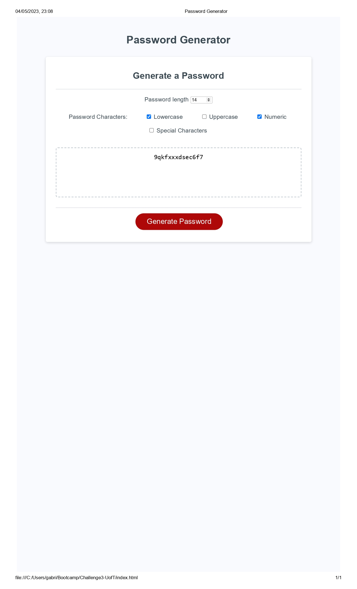

# Password generator - Challenge 3

## Description
This is a simple web application that generates a random password based on user preferences. The user can select the length of characters and types. They can include in their password, such as uppercase letters, lowercase letters, numerics, and special characters. To generate the password is mandatory to pick, at least, one type of the password characters. 

They can also choose the length of the password they want to generate in a range between 8 to 20. The value "8" is set in by default when you load the website. 

This app has built dynamically updated HTML and CSS powered by JavaScript code that you write. Additionally, it is a responsive user interface that adapts to multiple screen sizes.

## Getting started
To access the website, simply type in the website address into your web browser (https://gabrielparada05.github.io/Password-generator-C3-UofT/). Once the website loads, you will be presented with the homepage. From there, you can navigate to the website and create your password.

A screenshot is available inside the assets folder.

## Credits

Thank you to UofT Coding Bootcamp Team for providing everything I need to build this page. A huge thank you to https://www.w3schools.com/; https://www.freecodecamp.org/; and https://developer.mozilla.org/en-US/. Those amazing websites have been fundamental in this journey. 

## License 

Please refer to the License in the repo.

---

## How to Contribute

You can contribute to this Guide through (https://github.com/gabrielparada05/Password-generator-C3-UofT)

Thank you for visiting my website and supporting my learning journey. 

Gabriel Parada
gabrielparada05@gmail.com
